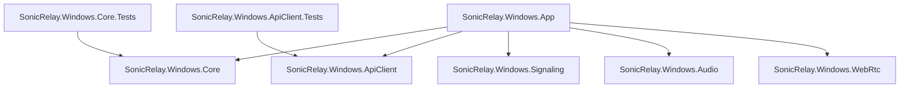
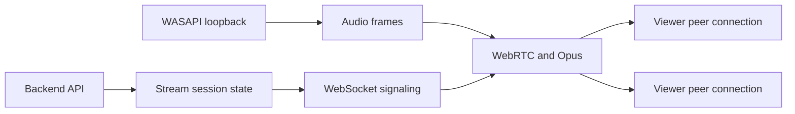

# Architecture

## Project boundaries

- **App** is the WinUI 3 composition root and owns desktop lifecycle and presentation.
- **Core** will hold application-independent domain state and rules.
- **ApiClient** will implement typed backend HTTP communication.
- **Signaling** will manage future WebSocket signaling messages and connection state.
- **Audio** will own WASAPI loopback capture and audio-frame delivery.
- **WebRtc** will own peer connections, negotiation, and Opus publication.

At bootstrap time the five capability libraries are intentionally empty. Their project references establish dependency direction without inventing abstractions before requirements exist.

## Planned runtime data flow

The UI will request operations through application-level orchestration added in later issues. Capability projects must not depend on the App project. Cross-cutting contracts should be introduced only when a concrete feature needs them.

## Error boundaries

Future external integrations will translate transport and platform failures into explicit results at their project boundaries. The UI will remain responsible for user-facing state. Unexpected failures will be logged without credentials, tokens, or raw sensitive signaling payloads.

## Non-goals for the bootstrap

- Authentication or token storage
- Backend URL configuration or production endpoints
- Device registration or stream-session behavior
- WebSocket connectivity
- WASAPI capture
- WebRTC, SDP, ICE, or Opus behavior
- Installer and release packaging
